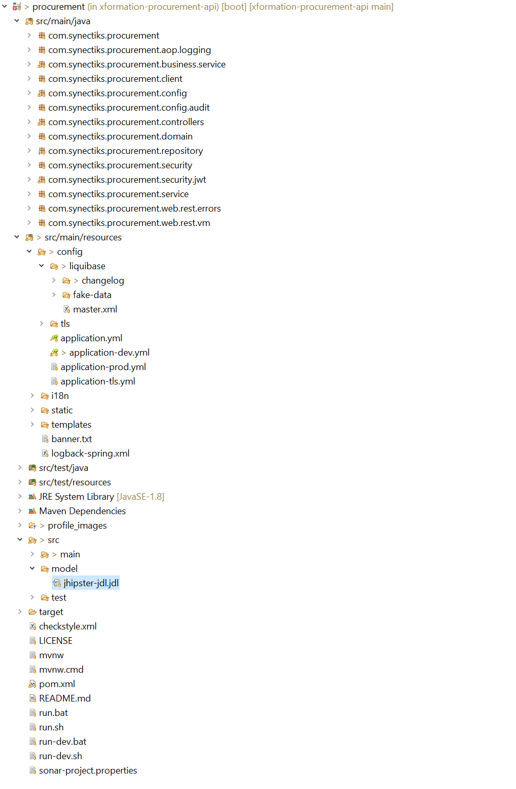

# xformation-procurement-api

- [xformation-procurement-api](#xformation-procurement-api)
  - [About](#about)
  - [Database and Data Model](#database-and-data-model)
  - [Quick start](#quick-start)
  - [Code Structure](#code-structure)
  - [Build the Source](#build-the-source)
  - [Contributing to Procurement](#contributing-to-procurement)
  - [Tests](#tests)
  - [Configure Development Environment](#configure-development-environment)
  - [Configure Production Environment](#configure-production-environment)

## About

This codebase is SpringBoot backend API's for Procurement solution. Procurement application has complete life cycle flow to create a requisition request, requisition approval, getting quotations from registered vendors against an approved requisition, purchase orders and invoicing of assets etc. It has user authentication and authorization and maintains the role based request flow with different roles like PSDS Admin, Budget holder, director general, requisition etc.
Procurement APIs provide access to user's emial inbox, that gives the user an advantage not to switch to the different email applications for their mails.

## Database and Data Model

**postgres** is used as backend database
The data model and ORM code is generated using jhipster.
**jhipster-jdl.jdl** file contains all the entity definitions

## Quick start

jhipster command is used for codebase setup

```
jhipster import-jdl src/model/jhipster-jdl.jdl
```

## Code Structure




| Loc            | Desc                       |   |
| ---------------- | ---------------------------- | --- |
| src/main/java/ | All Java source codes      |   |
| service        | All business services code |   |
| model          | All Pojo Model             |   |

## Build the Source

> NOTE: Procurement service is built and tested with JDK 8

Run mvn command in the root directory to clean build the application

```
mvn -e clean install
```

The above mvn command will execute all the test cases before making the build

To skip the test execution during the build, use -DskipTests=true with the command

```
mvn -e clean install -DskipTests=true
```

The resulting Procurement distribution can be found in the folder `/target`, i.e.

```
/target/procurement-0.0.1-SNAPSHOT.jar
```

Schema for dev profile is **procurementdev** and it is defined in **application-dev.yml** file
Schema for prod profile is **procurement** and it is defined in **application-prod.yml** file

## Contributing to Procurement

## Tests

## Configure Development Environment

Start Procurement service with dev profile

```
java -jar -Dspring.profiles.active=dev target/procurement-0.0.1-SNAPSHOT.jar
```

> NOTE: When service started with **dev** profile, faker.js inserts fake data in all the tables of **procurementdev** schema. Developer can focus on testing the APIs rather than putting efforts to generate test data before testing the core APIs.

## Configure Production Environment

Start Procurement service with prod profile

```
java -jar -Dspring.profiles.active=prod target/procurement-0.0.1-SNAPSHOT.jar
```
