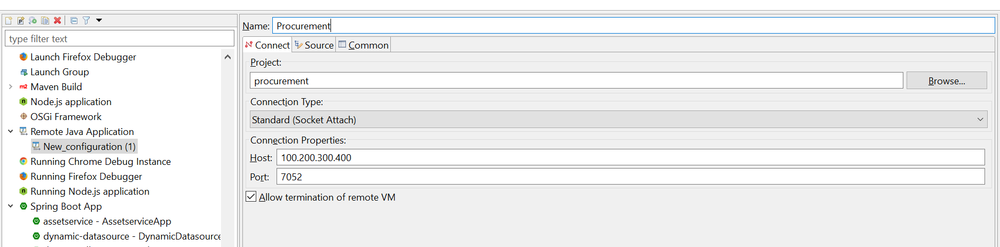

# xformation-procurement-api
- [xformation-procurement-api](#xformation-procurement-api)
  - [About](#about)
  - [Database and Data Model](#database-and-data-model)
  - [Quick start](#quick-start)
  - [Code Structure](#code-structure)  
  - [Build the Source](#build-the-source)
  - [Contributing to Procurement](#contributing-to-procurement)
  - [MockDev - API First Development](#mockdev)
  - [Tests](#tests)
  - [Run Development Environment](#run-development-environment)
  - [Create Sample Data](#create-sample-data)
  - [Run Production Environment](#run-production-environment)
  - [Postman Collection](#postman-collection)
  - [Run Postman Collection](#run-postman-collection)
  - [Remote debugging in Eclipse](#remote-debugging-in-eclipse)
  
## About 
  This codebase is SpringBoot backend API's for Procurement solution. Procurement application has complete life cycle flow to create a requisition request, requisition approval, getting quotations from registered vendors against an approved requisition, purchase orders and invoicing of assets etc. It has user authentication and authorization and maintains the role based request flow with different roles like PSDS Admin, Budget holder, director general, requisition etc.
  Procurement APIs provide access to user's email inbox, that gives the user an advantage not to switch to the different email applications for their mails.  

## Database and Data Model
  **postgres** is used as backend database  
  The data model and ORM code is generated using jhipster. **jhipster-jdl.jdl** file contains all the entity definitions  

  > [**ER Diagram**](ERD.md)  


## Quick start
  jhipster command is used for codebase setup  
  ```
  jhipster import-jdl src\model\jhipster-jdl.jdl
  ```
## Code Structure  
  > [Snapshot](CODE_STRUCTURE.md)  

  > Java package hierarchy  

  | Type | Package | 
  |-----------|:-----------|
  | Main | com.synectiks.procurement | 
  | Config | com.synectiks.procurement.config |
  | Entities | com.synectiks.procurement.domain |  
  | Controller | com.synectiks.procurement.controllers |
  | Services | com.synectiks.procurement.business.service |
  | Repository | com.synectiks.procurement.repository |
  | Security | com.synectiks.procurement.security |  
  
  > Resources  

  | Files/Directories | Details | 
  |-----------|:-----------|
  | config/liquibase/changelog | All the liquibase specific database entities (e.g. 20210722052455_added_entity_Document.xml) and their constraint definitions (e.g. 20210722052455_added_entity_constraints_Document.xml) found in changelog directory. <br> Liquibase executes the DDL and DMLs based on the definitions given in these files |
  | config/liquibase/fake-data | It contains CSV files which contains dummy data for all the entities. if faker is turned on in Spring cofig file, faker.js inserts that data into the tables after server starts up. <br> **To make it work, make an entry of faker in liquibase context**|
  | config/liquibase/master.xml | master.xml is the main file for liquibase. All the changelog files must be registered in master.xml |  
  

## Build the Source  
> NOTE: Procurement service is built and tested with JDK 8  

  Run mvn command in the root directory to clean build the application  
  
  ```
  mvn -e clean install
  ```
  The above mvn command will execute all the test cases before making the build  
  
  To skip the test execution during the build, use -DskipTests=true with the command  
  ```
  mvn -e clean install -DskipTests=true
  ```

  The resulting Procurement distribution can be found in the folder `/target`, i.e.
  ```
  /target/procurement-0.0.1-SNAPSHOT.jar
  ```

  Schema for dev profile is **procurementdev** and it is defined in **application-dev.yml** file  
  Schema for prod profile is **procurement** and it is defined in **application-prod.yml** file  

## Contributing to Procurement  

## MockDev  

## Tests
  
  Jhipster by-default provides JUnit test cases for all the APIs  
  Jhipster provides the **Cucumber** (automation testing) and **Gatling** (load testing) test setup at the time of codebase setup  

## Run Development Environment  
  Start Procurement service with dev profile  
  ```
  java -jar -Dspring.profiles.active=dev target/procurement-0.0.1-SNAPSHOT.jar
  ```  

## Create Sample Data  

  When service started with **dev** profile, faker.js inserts fake data in all the tables of **procurementdev** schema. Developer can focus on testing the APIs rather than putting efforts to generate test data before testing the core APIs.  

## Run Production Environment  
  Start Procurement service with prod profile  
  ```
  java -jar -Dspring.profiles.active=prod target/procurement-0.0.1-SNAPSHOT.jar  
  ```  

## Postman Collection
 [collection](POSTMAN_COLLECTION.md)  

## Run Postman Collection  
  
  > Import postman collection given in [Postman Collection](POSTMAN_COLLECTION.md) file  

  > Open the context menu of Procurement collection and click on Run collection  

## Remote debugging in Eclipse  
  
  Make following entry in pom.xml

  ```
    <plugins>
        <plugin>
              <groupId>org.springframework.boot</groupId>
              <artifactId>spring-boot-maven-plugin</artifactId>
              <version>${spring-boot.version}</version>
              <executions>
                  <execution>
                      <goals>
                          <goal>repackage</goal>
                      </goals>
                  </execution>
              </executions>
              <configuration>
                  <mainClass>${start-class}</mainClass>
                  <fork>true</fork>
                  <jvmArguments>-agentlib:jdwp=transport=dt_socket,server=y,suspend=n,address=7052</jvmArguments>
              </configuration>
        </plugin>
    </plugins>
  ```  

  Complete the eclipse configuration. Follow the steps given below:  
  > Go to Run -> Debug Configurations  
  > Create a new Remote Java Application configuration  
    
  > Click on apply  

  